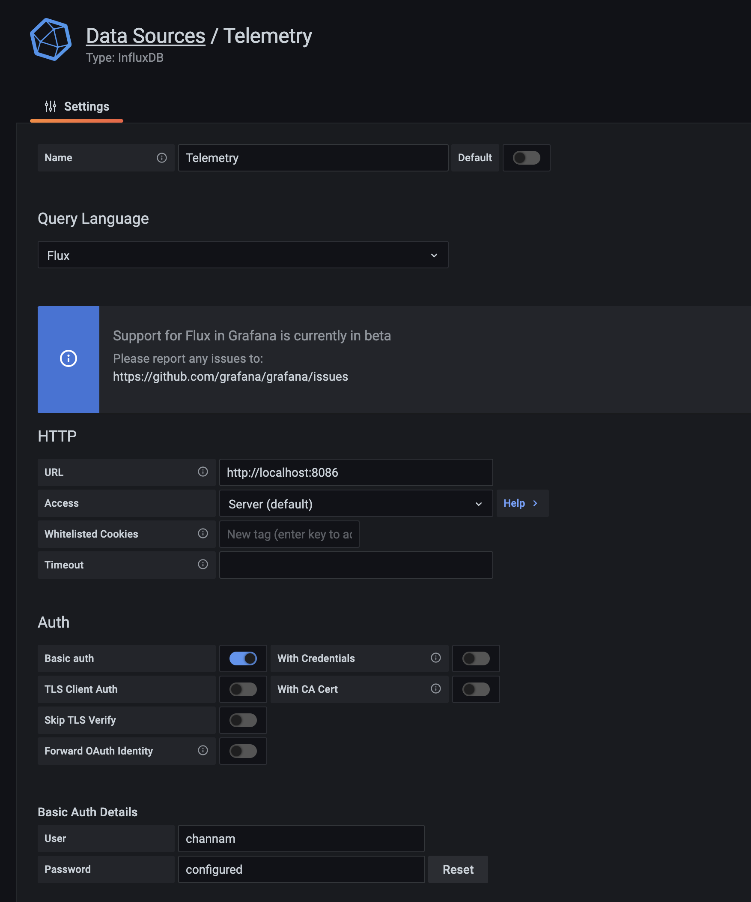
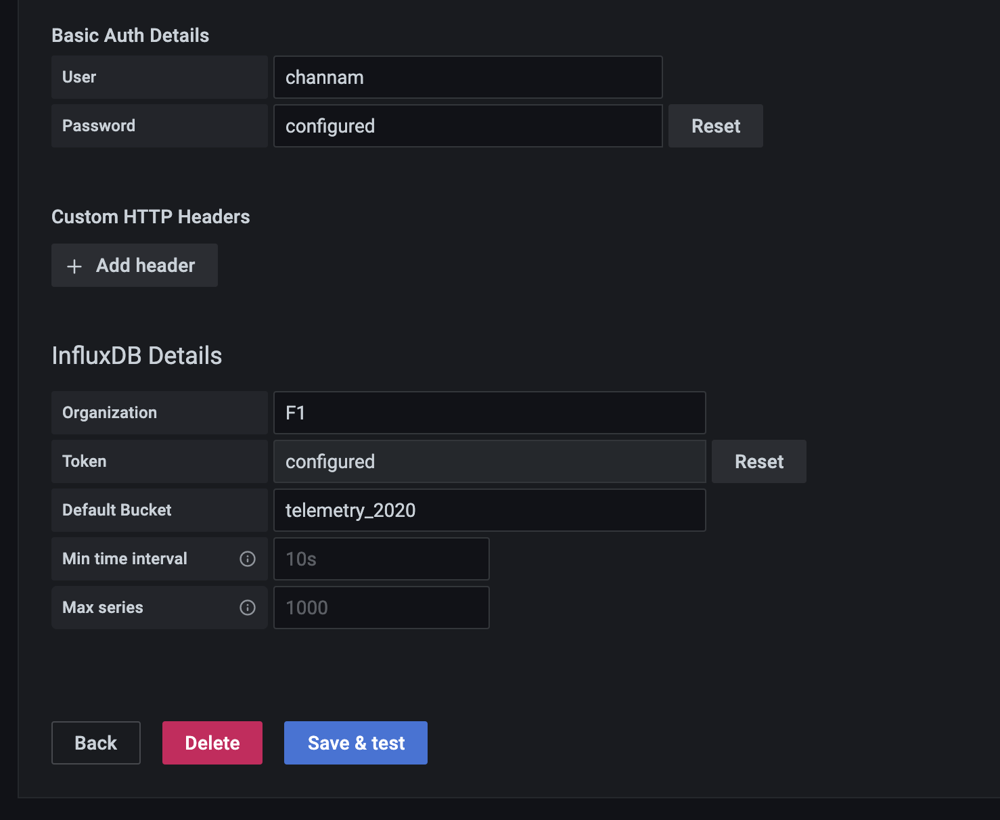
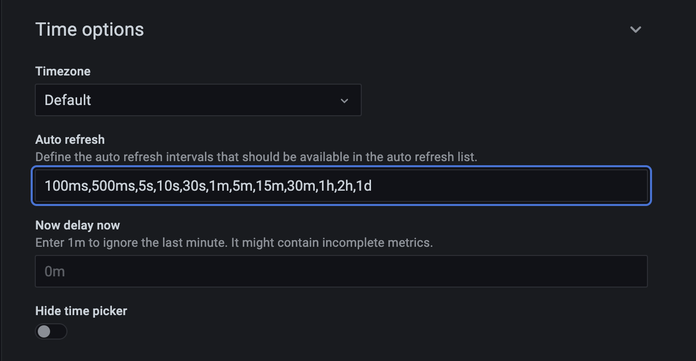

# F1 2020 - The Official Video Game from Codemasters
A tool for forwarding the UDP telemetry data from the simulator game F1 2020 to InfluxDB
for display via ang graphing application.

(UDP Specification)[https://forums.codemasters.com/topic/54423-f1%C2%AE-2020-udp-specification/]

# Data Storage
I used [InfluxDB](https://www.influxdata.com/) which is a great time series database.
See (Docker Hub)[https://hub.docker.com/_/influxdb].
```bash
docker pull quay.io/influxdb/influxdb:latest
```

# Graphing Using Grafana
I used Grafana to connect to InfluxDB. See - https://grafana.com/docs/grafana/latest/installation/docker/
```bash
docker run -d -p 3000:3000 grafana/grafana
```

## Connection to InfluxDB
Connecting to InfluxDB 2 requires 7.1 and above.




## Refresh Rate
To enable sub second updates, alter the following in `/etc/grafana/grafana.ini`

```ini
#################################### Dashboards History ##################
[dashboards]
# Number dashboard versions to keep (per dashboard). Default: 20, Minimum: 1
;versions_to_keep = 20
min_refresh_interval = 100ms
```

Next add the refresh rate as an option in the dashboard setting, otherwise you won't be able
to select it.




# Links
* Excellent Telemetry tool [PXG F1](https://bitbucket.org/Fiingon/pxg-f1-telemetry/src)
* Library for reading packets [Python](https://pypi.org/project/f1-2020-telemetry/)
* Similar project using [Kafka](https://www.youtube.com/watch?v=Re9LOAYZi2A) and 
  with [Camel](https://www.youtube.com/watch?v=2efOtyFAZ4s)
  
# Demo
Youtube:
* [Grafana Demo](https://youtu.be/zWDqIcY03e0)

